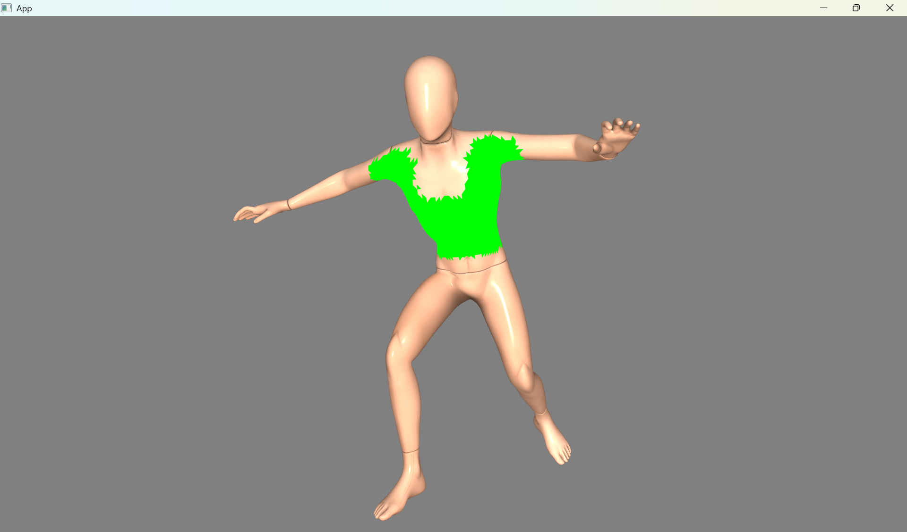
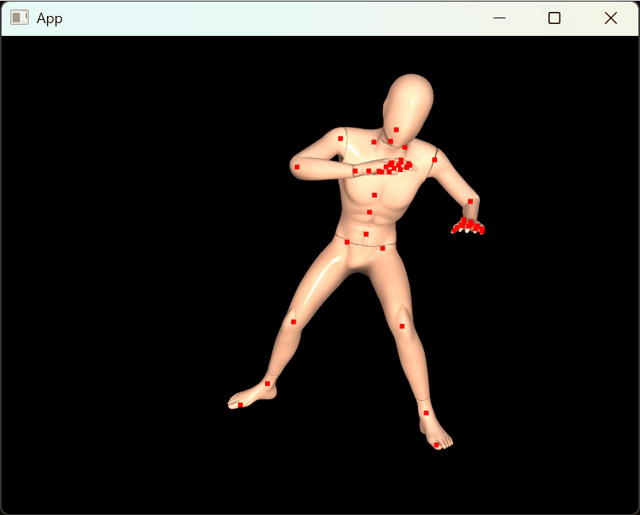

# Skeletal Animation

Example from <https://learnopengl.com/Guest-Articles/2020/Skeletal-Animation>:


## How to run

```
build\Release\main.exe Capoeira_Mannequin.dae
```

`Capoeira_Mannequin.dae` comes from [mixamo](https://www.mixamo.com/):

 * select "Mannequin" for Characters and
 * "Capoeira" for Animations.
 * Download as Collada(.Dae) Format, With Skin.

Original dancing_vampire.dae from the article could be found on [LearnOpenGL github](https://github.com/JoeyDeVries/LearnOpenGL/tree/6159792dec67ff0ba70f7fd2eafd88b683730e64/resources/objects/vampire).  

Note on FBX and Assimp:

 * FBX and Assimp embed textures; current code supports only embedded png textures.
 * As of Assimp v5.4.3/VCPKG release there are issues with wrong/inverted rotations (? [maybe this bug](https://github.com/assimp/assimp/issues/4714)); latest [head](https://github.com/assimp/assimp/tree/55e635943666241413c7d544556468c66aa11f13) seems to have it fixed, but there are other issues present;
 * try different formats first (like Collada) to make sure same issue present, if any, for multiple formats.

## How to build

Just CMake with VCPKG:

```
cmake -S . -B build ^
	-DCMAKE_TOOLCHAIN_FILE=%VCPKG_ROOT%\scripts\buildsystems\vcpkg.cmake
cmake --build build --config Release
```

Alternatively, dependencies are (see vcpkg.json):

 - ASSIMP: `vcpkg install assimp`.
 - GLM: `vcpkg install glm`.
 - STB: `vcpkg install stb`.
 - GLAD: `vcpkg install glad`.
 - GLFW: `vcpkg install glfw3`.

Once installed, compile and link main.cpp with C++20 enabled.

## Debugging

It's possible to:

 * pause animation by pressing `Space` button
 * scale model; pass `--scale 0.2` to command line
 * change animation speed; pass `--speed 2` to command line
 * choose different animation if file contains multiple animations; pass `--animation 3` to command line
 * highlight part of a mesh affected by a given bone (see below)
 * dump skeleton/scene hierarchy information

### Highlight part of a mesh

After Animation load, there is a dump of useful information.
For instance, Capoeira_Mannequin.dae shows:

```
id |name                        |parent id |children ids   |bone id |vertices |
0  |RootNode                    |-         |1 66           |-       |-        |
1  |mixamorig1_Hips             |0         |2 7 12         |0       |15552    |
2  |mixamorig1_RightUpLeg       |1         |3              |1       |11190    |
3  |mixamorig1_RightLeg         |2         |4              |32      |9681     |
4  |mixamorig1_RightFoot        |3         |5              |34      |6368     |
5  |mixamorig1_RightToeBase     |4         |6              |33      |4066     |
6  |mixamorig1_RightToe_End     |5         |-              |-       |-        |
7  |mixamorig1_LeftUpLeg        |1         |8              |2       |11075    |
8  |mixamorig1_LeftLeg          |7         |9              |9       |9681     |
9  |mixamorig1_LeftFoot         |8         |10             |10      |6368     |
10 |mixamorig1_LeftToeBase      |9         |11             |11      |4066     |
11 |mixamorig1_LeftToe_End      |10        |-              |-       |-        |
12 |mixamorig1_Spine            |1         |13             |12      |7694     |
13 |mixamorig1_Spine1           |12        |14             |8       |12296    |
14 |mixamorig1_Spine2           |13        |15 39 63       |7       |15570    |
15 |mixamorig1_RightShoulder    |14        |16             |30      |5221     |
16 |mixamorig1_RightArm         |15        |17             |31      |6411     |
17 |mixamorig1_RightForeArm     |16        |18             |35      |3979     |
18 |mixamorig1_RightHand        |17        |19 23 27 31 35 |36      |4642     |
19 |mixamorig1_RightHandPinky1  |18        |20             |47      |2187     |
20 |mixamorig1_RightHandPinky2  |19        |21             |48      |1581     |
21 |mixamorig1_RightHandPinky3  |20        |22             |49      |1008     |
22 |mixamorig1_RightHandPinky4  |21        |-              |-       |-        |
23 |mixamorig1_RightHandRing1   |18        |24             |44      |1652     |
24 |mixamorig1_RightHandRing2   |23        |25             |45      |1501     |
25 |mixamorig1_RightHandRing3   |24        |26             |46      |654      |
26 |mixamorig1_RightHandRing4   |25        |-              |-       |-        |
27 |mixamorig1_RightHandMiddle1 |18        |28             |37      |1485     |
28 |mixamorig1_RightHandMiddle2 |27        |29             |40      |1493     |
29 |mixamorig1_RightHandMiddle3 |28        |30             |39      |1008     |
30 |mixamorig1_RightHandMiddle4 |29        |-              |-       |-        |
31 |mixamorig1_RightHandIndex1  |18        |32             |43      |1521     |
32 |mixamorig1_RightHandIndex2  |31        |33             |41      |1581     |
33 |mixamorig1_RightHandIndex3  |32        |34             |42      |1134     |
34 |mixamorig1_RightHandIndex4  |33        |-              |-       |-        |
35 |mixamorig1_RightHandThumb1  |18        |36             |38      |1738     |
36 |mixamorig1_RightHandThumb2  |35        |37             |50      |1730     |
37 |mixamorig1_RightHandThumb3  |36        |38             |51      |1067     |
38 |mixamorig1_RightHandThumb4  |37        |-              |-       |-        |
39 |mixamorig1_LeftShoulder     |14        |40             |6       |5181     |
40 |mixamorig1_LeftArm          |39        |41             |5       |6411     |
41 |mixamorig1_LeftForeArm      |40        |42             |13      |3979     |
42 |mixamorig1_LeftHand         |41        |43 47 51 55 59 |14      |4642     |
43 |mixamorig1_LeftHandPinky1   |42        |44             |22      |2187     |
44 |mixamorig1_LeftHandPinky2   |43        |45             |25      |1581     |
45 |mixamorig1_LeftHandPinky3   |44        |46             |26      |1008     |
46 |mixamorig1_LeftHandPinky4   |45        |-              |-       |-        |
47 |mixamorig1_LeftHandRing1    |42        |48             |23      |1652     |
48 |mixamorig1_LeftHandRing2    |47        |49             |24      |1501     |
49 |mixamorig1_LeftHandRing3    |48        |50             |27      |654      |
50 |mixamorig1_LeftHandRing4    |49        |-              |-       |-        |
51 |mixamorig1_LeftHandMiddle1  |42        |52             |18      |1485     |
52 |mixamorig1_LeftHandMiddle2  |51        |53             |16      |1493     |
53 |mixamorig1_LeftHandMiddle3  |52        |54             |17      |1008     |
54 |mixamorig1_LeftHandMiddle4  |53        |-              |-       |-        |
55 |mixamorig1_LeftHandIndex1   |42        |56             |21      |1521     |
56 |mixamorig1_LeftHandIndex2   |55        |57             |20      |1581     |
57 |mixamorig1_LeftHandIndex3   |56        |58             |19      |1134     |
58 |mixamorig1_LeftHandIndex4   |57        |-              |-       |-        |
59 |mixamorig1_LeftHandThumb1   |42        |60             |15      |1738     |
60 |mixamorig1_LeftHandThumb2   |59        |61             |28      |1730     |
61 |mixamorig1_LeftHandThumb3   |60        |62             |29      |1067     |
62 |mixamorig1_LeftHandThumb4   |61        |-              |-       |-        |
63 |mixamorig1_Neck             |14        |64             |4       |2446     |
64 |mixamorig1_Head             |63        |65             |3       |6348     |
65 |mixamorig1_HeadTop_End      |64        |-              |-       |-        |
66 |Ch36                        |0         |-              |-       |-        |
```

where `id` is an id of an Assimp' scene Node (not an animation bone/joint). `bone id`
is an internal index of a bone/joint used by vertex shader to transform vertices. `vertices` column shows the amount of vertices affected by a given bone/joint/node.

Vertex shader in main.cpp has `int debug_bone_id = -1` config. Setting it to an existing bone, like 8 for mixamorig1_Spine1 above will highlight part of a mesh affected by a given bone:



### Render joints/bones only

(Not submitted). Render joints/bones as (red) points:

```
// Animation::update().
std::vector<glm::mat4> _nodes_transforms;
_nodes_transforms[bone_index] = _global_inverse * node.transform;

// Render.
render_points._points.clear();
for (glm::mat4 m : animation.nodes_transforms())
{
    const glm::vec4 p = m * glm::vec4(0.0f, 0.0f, 0.0f, 1.0f);
    render_points._points.push_back(glm::vec3(p / p.w));
}
glDisable(GL_DEPTH_TEST);
render_points.draw(mvp);
glEnable(GL_DEPTH_TEST);
```


