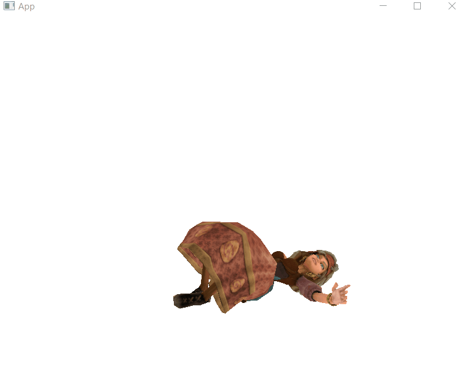

# Skeletal Animation example from <https://learnopengl.com/Guest-Articles/2020/Skeletal-Animation>.



^ "Peasant Girl" from [mixamo.com](https://www.mixamo.com).  

# How to run.

```
# Any model with format ASSIMP supports can be loaded.
main vampire/dancing_vampire.dae
```

`dancing_vampire.dae` can be downloaded from [LearnOpenGL github](https://github.com/JoeyDeVries/LearnOpenGL/tree/6159792dec67ff0ba70f7fd2eafd88b683730e64/resources/objects/vampire).  

# How to build.

See dependencies from `#include`(s):

 - ASSIMP: `vcpkg install assimp`.
 - GLM: `vcpkg install glm`.
 - STB: `vcpkg install stb`.
 - GLAD: `vcpkg install glad`.
 - GLFW: `vcpkg install glfw3`.

Once installed, compile and link with C++20 enabled.
