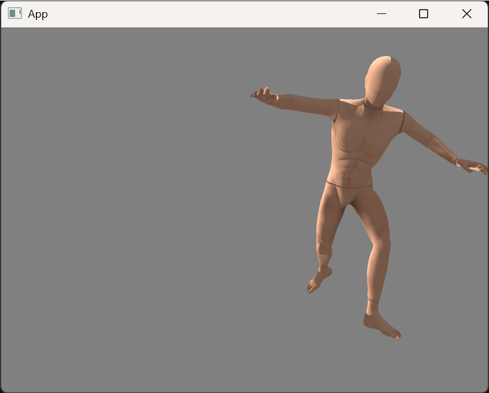

# Skeletal Animation

Example from <https://learnopengl.com/Guest-Articles/2020/Skeletal-Animation>:



# How to run

```
build\Release\main.exe Capoeira_Mannequin.dae
```

`Capoeira_Mannequin.dae` comes from [mixamo](https://www.mixamo.com/):

 * select "Mannequin" for Characters and
 * "Capoeira" for Animations.
 * Download as Collada(.Dae) Format, With Skin.

Original dancing_vampire.dae from the article could be found on [LearnOpenGL github](https://github.com/JoeyDeVries/LearnOpenGL/tree/6159792dec67ff0ba70f7fd2eafd88b683730e64/resources/objects/vampire).  

Note on FBX and Assimp:

 * FBX and Assimp embed textures; current code supports only embedded png textures.
 * As of Assimp v5.4.3/VCPKG release there are issues with wrong/inverted rotations (? [maybe this bug](https://github.com/assimp/assimp/issues/4714)); latest [head](https://github.com/assimp/assimp/tree/55e635943666241413c7d544556468c66aa11f13) seems to have it fixed, but there are other issues present;
 * try different formats firts (like Collada) to make sure same issue present if any for multiple formats.

# How to build

Just CMake with VCPKG:

```
cmake -S . -B build ^
	-DCMAKE_TOOLCHAIN_FILE=%VCPKG_ROOT%\scripts\buildsystems\vcpkg.cmake
cmake --build build --config Release
```

Alternatively, dependencies are (see vcpkg.json):

 - ASSIMP: `vcpkg install assimp`.
 - GLM: `vcpkg install glm`.
 - STB: `vcpkg install stb`.
 - GLAD: `vcpkg install glad`.
 - GLFW: `vcpkg install glfw3`.

Once installed, compile and link main.cpp with C++20 enabled.
